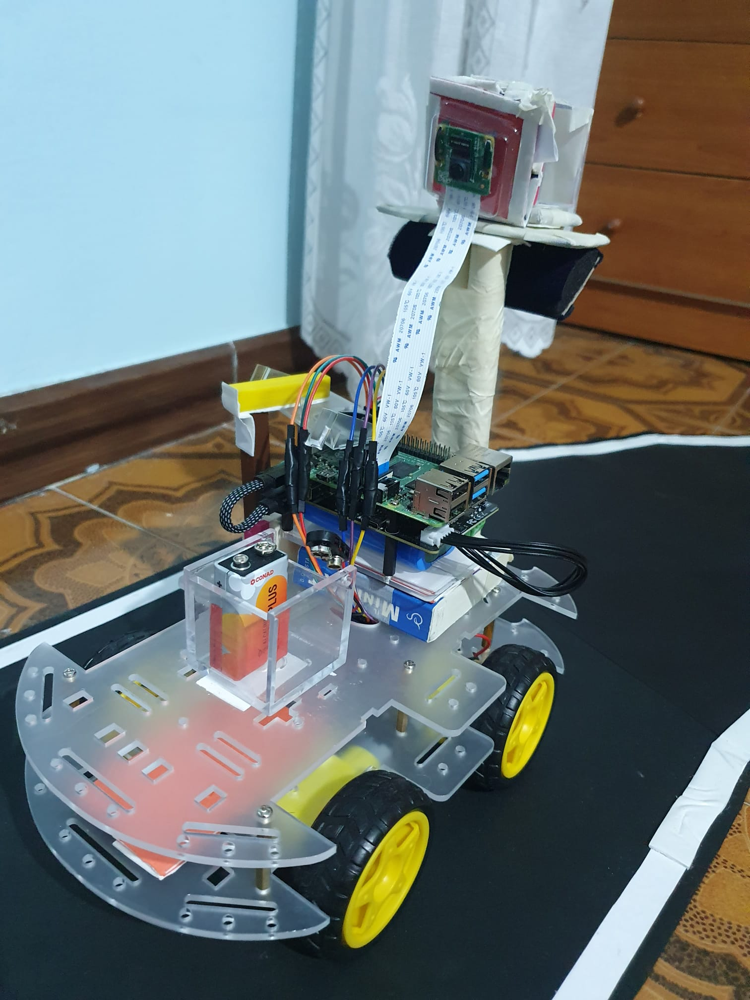

# 🚗 Raspby (the self driving car)

Welcome to the **Raspby (the self driving car)** project!  
This repository showcases our Computer Vision–based self-driving car prototype, developed using low-cost hardware and real-time image processing techniques.  

---

## 🌍 Introduction  

In recent years, self-driving cars have attracted significant interest. Designing systems capable of:  
- 🛣️ Identifying **road lanes**  
- 🛑 Recognizing **stop signs**  
- 🤖 Planning safe vehicle movements  

...can revolutionize urban mobility by:  
- ⏱️ Saving time & reducing stress  
- 🚦 Lowering traffic congestion  
- ♿ Offering accessible transportation for elderly and disabled individuals  

---

## 🛠️ Hardware Components  

The core of our self-driving prototype is a set of affordable yet powerful components:  

- 🍓 **Raspberry Pi 4B** – the brain of the vehicle  
- 📷 **Picamera module v2** – real-time vision  
- ⚡ **L298N Motor Controller** – managing motor movements  
- 🚙 **Robot car chassis with DC motors** – mobility foundation  

Additional components include:  
- 🔋 Two separate batteries (Pi & motor controller)  
- 🌬️ Cooling fan (to prevent overheating)  
- 🧵 Jumper wires (component communication)  

---

## 💻 Software Implementation  

Our implementation is written in **Python** using the **OpenCV** library.  
The software stack covers:  

1. **Lane Detection**  
   - Grayscale conversion 🎞️  
   - Gaussian Blur for noise reduction 🌫️  
   - Canny Edge Detection ✂️  
   - Region masking 🔲  
   - Hough Transform to detect lane lines ➖  

2. **Movement Planning**  
   - Lane center vs. frame center comparison ⚖️  
   - Calculation of a **“Result” score** → guides movements (left, right, forward)  

3. **Bird’s Eye View Perspective** 🦅  
   - Perspective transform → rectangle from trapezoid  
   - Thresholding + edge detection  
   - Histograms used to locate lane lines 📊  
   - Improved robustness under artificial lighting & higher speeds ⚡  

4. **Stop Sign Detection** 🛑  
   - Gaussian blur preprocessing  
   - HSV thresholding + morphological filters  
   - Contour detection with Douglas-Peucker algorithm  
   - Shape recognition → **octagonal contour = stop sign**  

---

## 📚 Research References  

- **Lane Detection** → *"A Lane Detection Using Image Processing Technique for Two-Lane Road"* (2022)  
- **Stop Sign Detection** → *"Traffic sign detection optimization using color and shape segmentation as a pre-processing system"* (2021)  

---

## 🎥 Demonstrations  

- ✅ Lane detection in real-time  
- ✅ Robust tracking under artificial lighting  
- ✅ Stop sign detection and full vehicle stop  

📌 Check out the demo videos included in the repository for a closer look at our results!  

---
